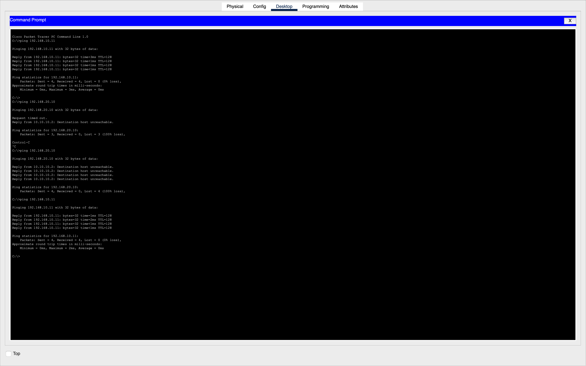

# Packet Tracer Static Routing Lab (Two-LAN Network)

This project demonstrates how to design, configure, and troubleshoot a two-LAN network connected by two routers using Cisco Packet Tracer. The lab includes switch and router configuration, IP addressing, static routing, connectivity testing, and hands-on troubleshooting of interface issues.

This repository contains:
- Full network topology  
- Device configurations  
- Static routing setup  
- Troubleshooting steps  
- Ping verification tests  
- Screenshots documenting the entire build  

---

# Project Overview

This lab simulates two separate LANs connected through two routers:

- LAN A → Router0 → Router1 → LAN B  
- Each LAN has two PCs and one switch  
- Routers are connected via a GigabitEthernet crossover link  
- Static routing enables communication between the networks  

Objectives:
1. Build the topology  
2. Assign IP addressing  
3. Configure routers and interfaces  
4. Add static routes  
5. Test same-LAN and cross-LAN communication  
6. Troubleshoot down interfaces  
7. Verify full connectivity  

---

# Final Network Topology

### Initial Topology (Before Cabling)
.png)

---

# Physical Cabling Layout

### Completed Physical Topology (With Cables)
.png)

---

# Final Network State (All Links Up)

.png)

---

# IP Addressing Plan

| Device | IP Address | Subnet Mask | Gateway |
|--------|------------|-------------|---------|
| PC0 | 192.168.10.10 | 255.255.255.0 | 192.168.10.1 |
| PC1 | 192.168.10.11 | 255.255.255.0 | 192.168.10.1 |
| Router0 G0/0 | 192.168.10.1 | 255.255.255.0 | — |
| Router0 G0/1 | 10.10.10.1 | 255.255.255.252 | — |
| Router1 G0/1 | 10.10.10.2 | 255.255.255.252 | — |
| Router1 G0/0 | 192.168.20.1 | 255.255.255.0 | — |
| PC2 | 192.168.20.10 | 255.255.255.0 | 192.168.20.1 |
| PC3 | 192.168.20.11 | 255.255.255.0 | 192.168.20.1 |

---

# Router Configuration Summary

## Router0
```bash
enable
configure terminal

interface gigabitEthernet0/0
 ip address 192.168.10.1 255.255.255.0
 no shutdown

interface gigabitEthernet0/1
 ip address 10.10.10.1 255.255.255.252
 no shutdown

exit
ip route 192.168.20.0 255.255.255.0 10.10.10.2
```

---

## Router1
```bash
enable
configure terminal

interface gigabitEthernet0/0
 ip address 192.168.20.1 255.255.255.0
 no shutdown

interface gigabitEthernet0/1
 ip address 10.10.10.2 255.255.255.252
 no shutdown

exit
ip route 192.168.10.0 255.255.255.0 10.10.10.1
```

---

# Connectivity Testing

## Same-LAN Ping Tests
- PC0 → PC1: Success  
- PC2 → PC3: Success  

## Cross-LAN Ping Tests
After static routing was configured:

- PC0 → PC2: Success  
- PC0 → PC3: Success  
- PC1 → PC2: Success  
- PC1 → PC3: Success  

---

# Troubleshooting Summary

Issue Encountered:  
Router1 G0/0 and the switch port were initially down (red), preventing communication between the two networks.

Fix Applied:
```bash
enable
configure terminal
interface gigabitEthernet0/0
 no shutdown
```

After enabling the interface, the link turned green and cross-network routing began working correctly.

---

# Cross-Network Ping Output



---

# Skills Demonstrated
- Network topology design  
- Subnetting and IP addressing  
- Router and switch configuration  
- Troubleshooting interface issues  
- Static routing  
- End-to-end connectivity verification  
- Professional documentation using GitHub  

---

# Repository Structure
```
packet-tracer-static-routing-lab/
│
├── README.md
└── screenshots/
    ├── Initial Topology (Before Cabling).png
    ├── Completed Physical Topology (With Cables).png
    ├── Final Network State — All Links Up (Green).png
    └── 03-cross-network-ping-success.png
```

---

# Conclusion

This lab demonstrates how to design, build, and configure a two-LAN network in Cisco Packet Tracer using static routing.  
After resolving interface issues and verifying routing tables, full communication between all devices across both LANs was successfully achieved.

---

# Contact / Portfolio

GitHub: https://github.com/austingtucker437
